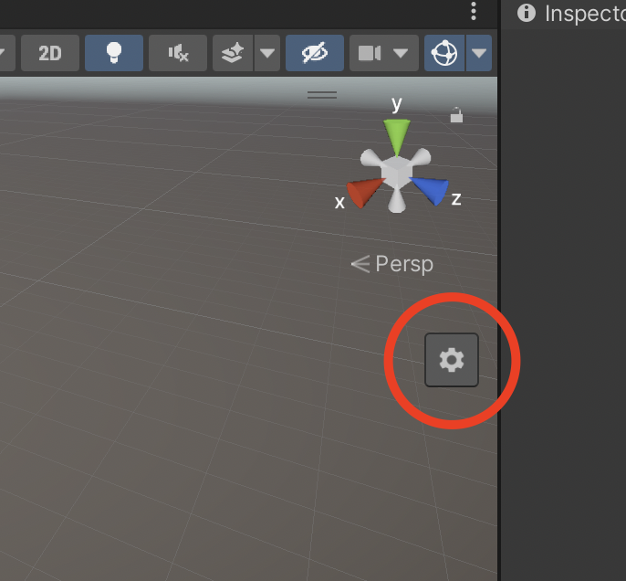
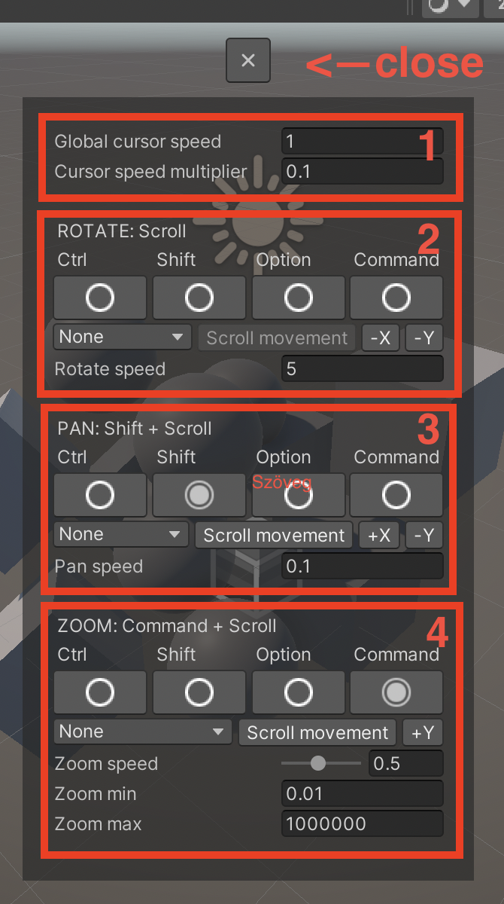

# TrackpadPro - TrackpadPro - Advanced SceneView controls

## Getting started

In order to use TrackpadPro we need to do a few basic steps:

- Import the asset into your project
- Close the Scene View tab if opened
- Go to __View menu__ and select __Scene View (TPP)__
- Adjust your layout to meet your requirements
- _(Optional)_ Save your editor layout

## Basic usage

If you happy with the blender default controls then you pretty much done!

You can use the following bindings by default:

- __Scroll (two finger move)__ Rotate the view around the pivot point
- __Shift + Scroll:__ Pan the view (moves the pivot point)
- __Command + Scoll:__ Zooms in and out

## Advanced bindings and settings

If you using a mouse or you want to specify a custom binding you can press the settings button:

After you clicked you should see the following settings panel:

### 1 - Cursor speed:

- __Global cursor speed__: This is the global mouse speed for every action
- __Cursor speed multiplier__: The speed of the mouse movement compared to scroll movement

### 2 - Rotate view:

- __After the text "ROTATE" you see the current binding__
- Below that you can specify wich button needed to perform the action
- Below the action keys you can specify the mouse events (Which mouse button needed, which axis used). __You can invert axes here!__
- __Rotate speed__: The speed of rotation around the pivot

### 3 - Pan view:

- __After the text "PAN" you see the current binding__
- Below that you can specify wich button needed to perform the action
- Below the action keys you can specify the mouse events (Which mouse button needed, which axis used). __You can invert axes here!__
- __Pan speed__: The speed of pan movement

### 4 - Zoom view:

- __After the text "ZOOM" you see the current binding__
- Below that you can specify wich button needed to perform the action
- Below the action keys you can specify the mouse events (Which mouse button needed, which axis used). __You can invert axes here!__
- __Zoom speed__: The speed of zoom movement
- __Zoom min__: The minimum amount of zoom
- __Zoom max__: The maximum amount of zoom

## Support & Contact

If you have any problems/questions feel free to email me:

Alex Kovács - [kovacsalex95@gmail.com](mailto:kovacsalex95@gmail.com)